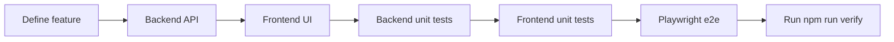

# Testing workflow (backend + frontend + Playwright)

Use this when you **add, update, or remove** a feature so all layers stay aligned.

## Quick commands

| Step | Command |
|------|---------|
| Unit tests (backend + frontend) | `npm run test` |
| E2E (needs Docker stack) | `docker compose up -d --build` then `npm run test:e2e` |
| Everything except e2e | `npm run test:ci` |
| Lint + build + unit + e2e | `npm run verify` |

## Change workflow



1. **Backend** — implement or change endpoints in `apps/backend/src/`.
2. **Frontend** — wire UI in `pages/`, `composables/`, `utils/`.
3. **Unit tests** — colocate specs as `*.spec.ts` next to the code they cover.
4. **E2E** — update `e2e/*.spec.ts` when the user journey changes (login, upload, search, etc.).
5. **Remove together** — if you delete a feature, delete its API, UI, unit tests, and e2e tests.

## Where tests live

| Type | Path |
|------|------|
| Backend unit | `apps/backend/src/**/*.spec.ts` |
| Frontend unit | `apps/frontend/**/*.spec.ts` |
| E2E | `e2e/auth.spec.ts`, `e2e/books.spec.ts`, helpers in `e2e/helpers/` |

## When to update which tests

| You changed… | Update |
|--------------|--------|
| DTO / validation / service logic | Backend `*.spec.ts` |
| Pure helper (e.g. auth-session, API URL resolver) | Frontend `*.spec.ts` |
| New page, button, or route | Frontend + `e2e/*.spec.ts` |
| Auth rules or JWT | `auth.service.spec.ts`, `auth-session.spec.ts`, `e2e/auth.spec.ts` |
| Book upload / parse / search | `books.service.spec.ts`, `xml-parser.service.spec.ts`, `e2e/books.spec.ts` |
| Removed feature | Remove matching specs and e2e flows |

## CI enforcement

On every PR to `main`, GitHub Actions runs:

- Lint + build + **unit tests**
- **Playwright e2e** against Docker Compose

Failing tests block merge until fixed.

## Cursor / AI assistance

The rule `.cursor/rules/full-stack-changes.mdc` reminds the agent to update backend, frontend, and Playwright together. Mention in your prompt:

> “Follow full-stack change workflow: update backend, frontend, unit tests, and e2e.”

## Optional: run one test file

```bash
npm run test --workspace apps/backend -- auth.service.spec
npm run test --workspace apps/frontend -- auth-session.spec
PLAYWRIGHT_BROWSERS_PATH=0 npx playwright test e2e/auth.spec.ts
```
